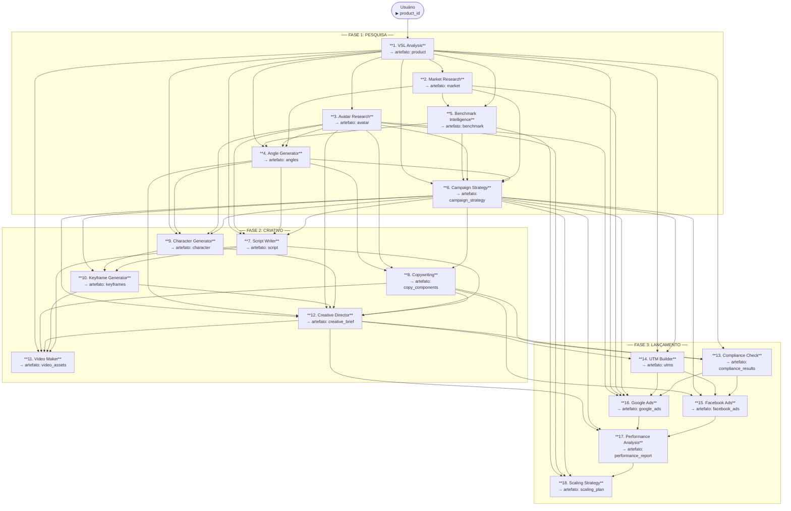
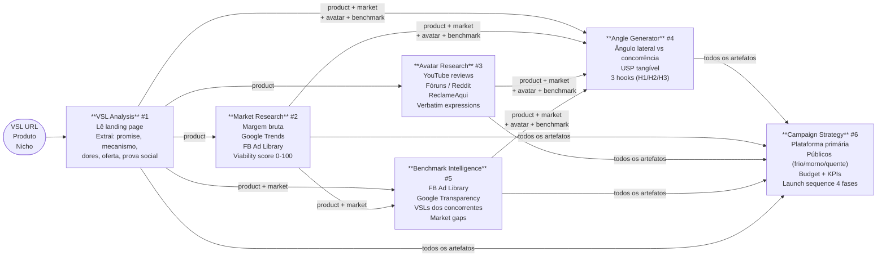
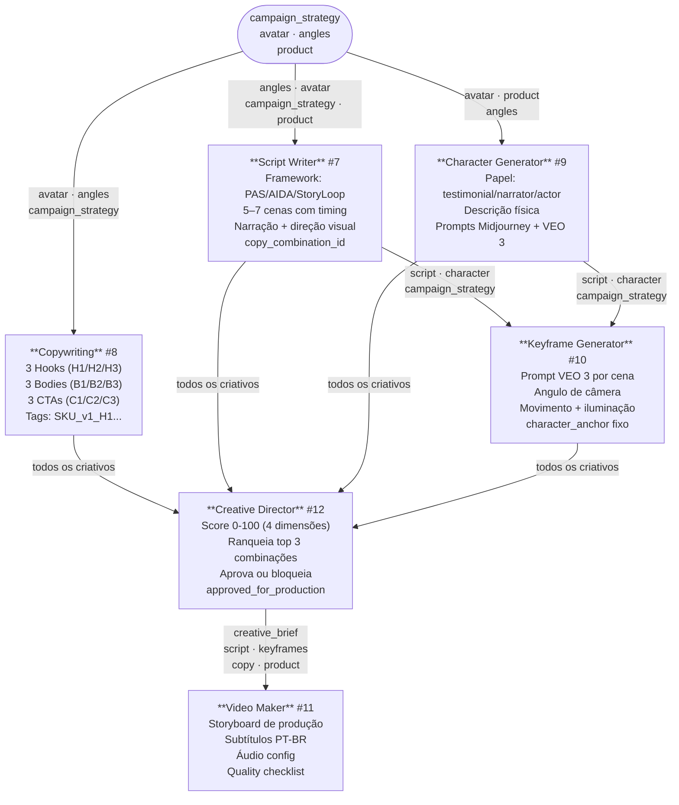
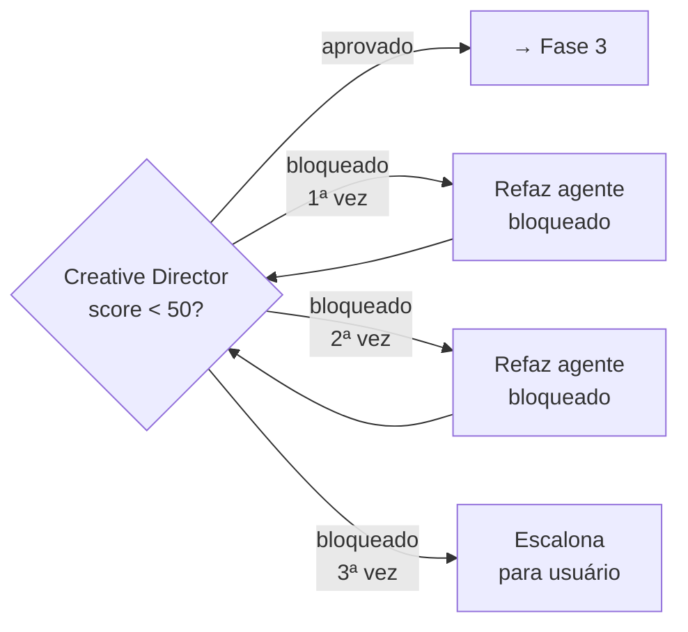
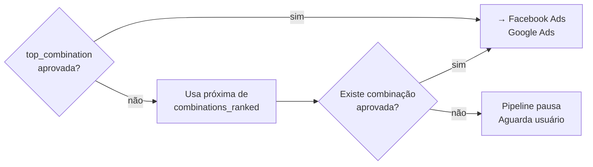
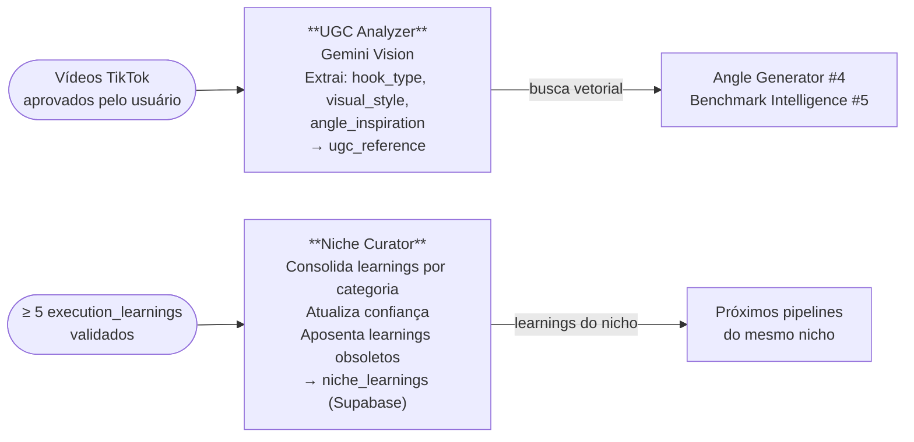
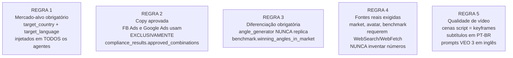

# AdCraft v3 — Mapa de Agentes e Fluxos de Interação

## Visão Geral do Pipeline



---

## Fase 1 — Pesquisa (Detalhado)



---

## Fase 2 — Criativo (Detalhado)



### Loops de Revisão (Fase 2)



---

## Fase 3 — Lançamento (Detalhado)

```mermaid
flowchart TD
    CD(["creative_brief\ncopy_components\nproduct"])

    CD -->|copy · product\ncreative_brief| CC["**Compliance Check** #13\nANVISA + FB + Google\nApproved/rejected por tag\napproved_combinations HxBxC"]

    CD & CS2(["campaign_strategy\nproduct"]) -->|creative_brief\ncampaign_strategy · product| UTM["**UTM Builder** #14\nConvenção: SKU_obj_AAAAMM\nUTM por plataforma\nURLs rastreadas testáveis"]

    CC & UTM -->|approved_combinations\nutms · campaign_strategy\ncopy| FB["**Facebook Ads** #15\nCBO/ABO\nAd Sets por público\nAnúncios só de copy aprovada\nPixel checklist"]

    CC & UTM -->|approved_combinations\nutms · market · product\navatar| GA["**Google Ads** #16\nSearch / Video / Display\nKeywords 3 camadas\nRSA headlines + descriptions\nExtensões"]

    FB & GA -->|dados reais\n(após 7+ dias)| PA["**Performance Analysis** #17\n4 níveis de diagnóstico\nClassifica: winner/testing/loser\nRecomendações priorizadas"]

    PA -->|performance_report\ncampaign_strategy\navatar · benchmark| SS["**Scaling Strategy** #18\nVertical (budget +20-30%)\nHorizontal (novos públicos)\nStop-loss criteria\nTimeline semanal"]
```

### Loop de Compliance (Fase 3)



---

## Agentes Extras (Fora do Pipeline Principal)



---

## Matriz de Artefatos

| # | Agente | Artefato produzido | Consumido por |
|---|--------|--------------------|---------------|
| 1 | VSL Analysis | `product` | 2, 3, 4, 5, 6, 7, 9, 11, 13, 14, 16 |
| 2 | Market Research | `market` | 4, 5, 6, 16, 18 |
| 3 | Avatar Research | `avatar` | 4, 6, 7, 8, 9, 12, 16, 18 |
| 5 | Benchmark Intelligence | `benchmark` | 4, 6, 18 |
| 4 | Angle Generator | `angles` | 6, 7, 8, 9, 12 |
| 6 | Campaign Strategy | `campaign_strategy` | 7, 8, 9, 10, 12, 14, 15, 16, 17, 18 |
| 8 | Copywriting | `copy_components` | 11, 12, 13, 15 |
| 7 | Script Writer | `script` | 10, 11, 12 |
| 9 | Character Generator | `character` | 10, 11 |
| 10 | Keyframe Generator | `keyframes` | 11, 12 |
| 12 | Creative Director | `creative_brief` | 11, 13, 14, 15, 17 |
| 11 | Video Maker | `video_assets` | _(output final)_ |
| 13 | Compliance Check | `compliance_results` | 15, 16 |
| 14 | UTM Builder | `utms` | 15, 16 |
| 15 | Facebook Ads | `facebook_ads` | 17 |
| 16 | Google Ads | `google_ads` | 17 |
| 17 | Performance Analysis | `performance_report` | 18 |
| 18 | Scaling Strategy | `scaling_plan` | _(output final)_ |

---

## Regras Críticas de Fluxo



---

## Paralelismo de Execução

```mermaid
gantt
    title Ordem de execução dos agentes
    dateFormat X
    axisFormat Agente %s

    section Fase 1
    1 - VSL Analysis         :a1, 0, 1
    2 - Market Research      :a2, after a1, 1
    3 - Avatar Research      :a3, after a1, 1
    5 - Benchmark Intel.     :a5, after a2, 1
    4 - Angle Generator      :a4, after a5, 1
    6 - Campaign Strategy    :a6, after a4, 1

    section Fase 2
    7 - Script Writer        :a7, after a6, 1
    8 - Copywriting          :a8, after a6, 1
    9 - Character Generator  :a9, after a6, 1
    10 - Keyframe Generator  :a10, after a7, 1
    12 - Creative Director   :a12, after a10, 1
    11 - Video Maker         :a11, after a12, 1

    section Fase 3
    13 - Compliance Check    :a13, after a12, 1
    14 - UTM Builder         :a14, after a12, 1
    15 - Facebook Ads        :a15, after a13, 1
    16 - Google Ads          :a16, after a13, 1
    17 - Performance Anal.   :a17, after a15, 1
    18 - Scaling Strategy    :a18, after a17, 1
```


